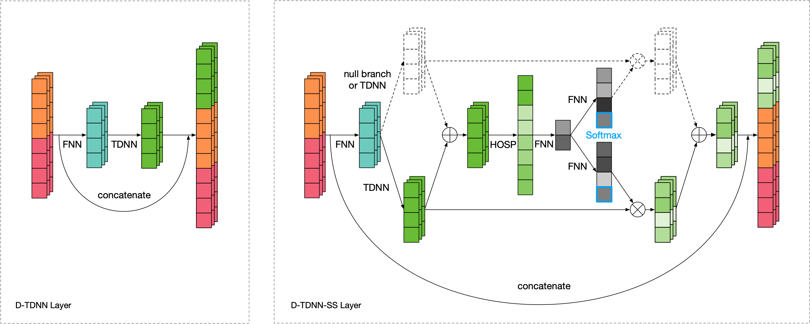

# Densely Connected Time Delay Neural Network

PyTorch implementation of Densely Connected Time Delay Neural Network (D-TDNN) in our paper ["Densely Connected Time Delay Neural Network for Speaker Verification"](https://www.isca-speech.org/archive/Interspeech_2020/abstracts/1275.html) (INTERSPEECH 2020).

### News

- [2023-05-04] [3D-Speaker](https://github.com/alibaba-damo-academy/3D-Speaker) supports training of CAM++ model and can be easily extended to support training of raw D-TDNN and CAM models. They also released a [Chinese speaker embedding model](https://modelscope.cn/models/damo/speech_campplus_sv_zh-cn_16k-common/summary) trained on 200k speakers and an [English speaker embedding model](https://modelscope.cn/models/damo/speech_campplus_sv_en_voxceleb_16k/summary) trained on VoxCeleb.

- [2023-03-04] [CAM++](https://arxiv.org/abs/2303.00332) achieved superior performance with lower computational complexity and faster inference speed than popular ECAPA-TDNN and ResNet34 systems.

  > H. Wang, S. Zheng, Y. Chen, L. Cheng, and Q. Chen, "CAM++: A Fast and Efficient Network for Speaker Verification Using Context-Aware Masking"

  | | VoxCeleb1-E | VoxCeleb1-H | CN-Celeb |
  | - | - | - | - |
  | ECAPA-TDNN | 1.07/0.1185 | 1.98/0.1956 | 7.45/0.4127 |
  | D-TDNN | 1.63/0.1748 | 2.86/0.2571 | 8.41/0.4683 |
  | CAM | 1.18/0.1257* | 2.15/0.1966* | - |
  | CAM++ | **0.89/0.0995** | **1.76/0.1729** | **6.78/0.3830** |

- [2021-09-05] TimeDelay is replaced by Conv1d by default, since convolution is better optimized in all kinds of deep learning frameworks (Note: The pretrained models are directly converted from the old ones so that the results might be slightly different from those in the paper).

- [2021-08-28] D-TDNN and D-TDNN-SS outperform SOTA system on the AP20-OLR-dialect-task of oriental language recognition (OLR) challenge 2020 ([WeChat artical](https://mp.weixin.qq.com/s/sr2ZBFj9njt47tlNNi8dNw) / [paper](https://arxiv.org/abs/2108.07787)), showing their potential on other speech processing tasks.

- [2021-02-01] [CAM](https://ieeexplore.ieee.org/document/9414704) adopts D-TDNN backbone and is enhanced by context-aware masking.

  > Y.-Q. Yu, S. Zheng, H. Suo, Y. Lei, and W.-J. Li, "CAM: Context-Aware Masking for Robust Speaker Verification" (ICASSP 2021)

  | | VoxCeleb1-E | VoxCeleb1-H |
  | - | - | - |
  | CAM | 1.18/0.1257 | 2.15/0.1966 |

### Pretrained Models

We provide the [pretrained models](https://github.com/yuyq96/D-TDNN/releases/tag/models) which can be used in many tasks such as:

- Speaker Verification
- Speaker-Dependent Speech Separation
- Multi-Speaker Text-to-Speech
- Voice Conversion



## Usage

#### Data preparation

You can either use [Kaldi](https://github.com/kaldi-asr/kaldi) toolkit:
- Download [VoxCeleb1](http://www.robots.ox.ac.uk/~vgg/data/voxceleb/vox1.html) test set and unzip it.
- Place `prepare_voxceleb1_test.sh` under `$kaldi_root/egs/voxceleb/v2` and change the `$datadir` and `$voxceleb1_root` in it.
- Run `chmod +x prepare_voxceleb1_test.sh && ./prepare_voxceleb1_test.sh` to generate [30-dim MFCCs](https://github.com/kaldi-asr/kaldi/blob/master/egs/voxceleb/v2/conf/mfcc.conf).
- Place the [`trials`](https://github.com/yuyq96/D-TDNN/releases/download/trials/trials) under `$datadir/test_no_sil`.

Or checkout the [kaldifeat](https://github.com/yuyq96/D-TDNN/tree/kaldifeat) branch if you do not want to install Kaldi.

#### Test

- Download the pretrained [D-TDNN](https://github.com/yuyq96/D-TDNN/releases/download/models/dtdnn.pth) model and run:
```
python evaluate.py --root $datadir/test_no_sil --model D-TDNN --checkpoint dtdnn.pth --device cuda
```

## Evaluation

VoxCeleb1-O

| Model | Emb. | Params (M) | Loss | Backend | EER (%) | DCF_0.01 | DCF_0.001 |
| :---- | :--: | :--------: | :--: | :-----: | :-----: | :------: | :-------: |
| [TDNN](https://github.com/yuyq96/D-TDNN/releases/download/models/tdnn.pth) | 512 | 4.2 | Softmax | PLDA | 2.34 | 0.28 | 0.38 |
| E-TDNN | 512 | 6.1 | Softmax | PLDA | 2.08 | 0.26 | 0.41 |
| F-TDNN | 512 | 12.4 | Softmax | PLDA | 1.89 | 0.21 | 0.29 |
| [D-TDNN](https://github.com/yuyq96/D-TDNN/releases/download/models/dtdnn.pth) | 512 | 2.8 | Softmax | Cosine | 1.81 | 0.20 | 0.28 |
| D-TDNN-SS (0) | 512 | 3.0 | Softmax | Cosine | 1.55 | 0.20 | 0.30 |
| D-TDNN-SS | 512 | 3.5 | Softmax | Cosine | 1.41 | 0.19 | 0.24 |
| D-TDNN-SS | 128 | 3.1 | AAM-Softmax | Cosine | 1.22 | 0.13 | 0.20 |

## Citation

If you find D-TDNN helps your research, please cite
```
@inproceedings{DBLP:conf/interspeech/YuL20,
  author    = {Ya-Qi Yu and
               Wu-Jun Li},
  title     = {Densely Connected Time Delay Neural Network for Speaker Verification},
  booktitle = {Annual Conference of the International Speech Communication Association (INTERSPEECH)},
  pages     = {921--925},
  year      = {2020}
}
```

### Revision of the Paper

References:

> [16] X. Li, W. Wang, X. Hu, and J. Yang, "Selective Kernel Networks," in IEEE Conference on Computer Vision and Pattern Recognition (CVPR), 2019, pp. 510-519.
